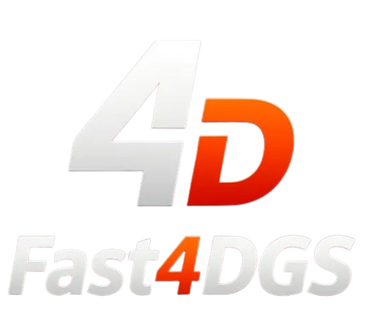
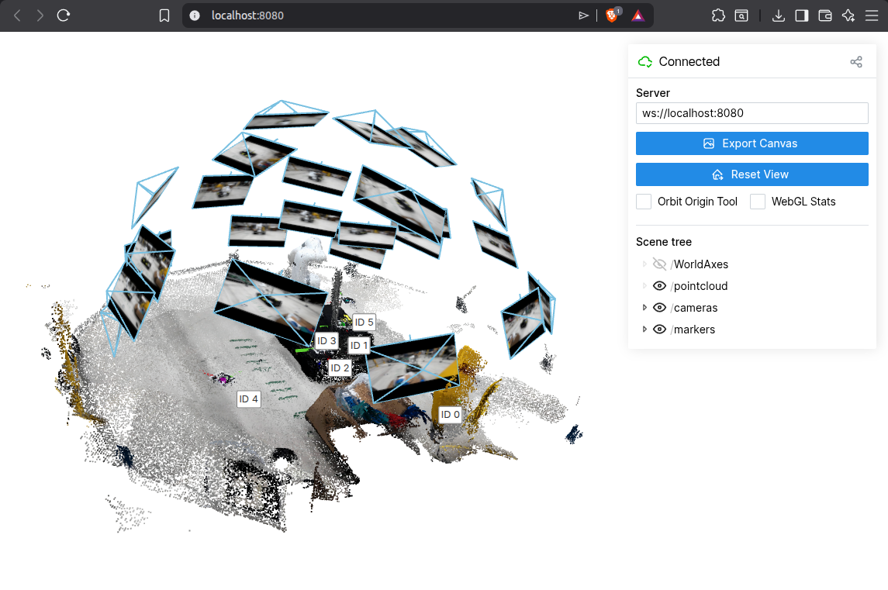

<div align="center">
   
  

  <h1><strong>Fast4DGS: Ultra-fast pointcloud and 3D reconstruction from multiview images.</strong></h1>
  
  <strong>Anurag Dalal</strong><br>
  <em>Department of Engineering Sciences, University of Agder, Jon Lilletuns vei 9, 4879 Grimstad, Norway</em>

  <p>
    <a href="https://github.com/anurag-dalal" target="_blank">
      
    </a>
    <a href="https://www.linkedin.com/in/anurag-dalal-2817a1134/" target="_blank">
      
    </a>
    <a href="https://orcid.org/0009-0007-9228-8222" target="_blank">
      
    </a>
    <a href="mailto:anurag.dalal@uia.no">
      
    </a>
  </p>
</div>

---

## Overview

Real-time multi-view 3D reconstruction pipeline that ingests live GStreamer video streams from 24 synchronised cameras (4 Jetson nodes × 6 cameras each), runs [VGGT](https://github.com/facebookresearch/vggt) for depth estimation and pose recovery, detects ArUco markers with full 6-DoF pose in the reconstructed point cloud, and streams the result to a Viser web viewer or ROS 2 topic.

### Key Features

- **Live multi-camera capture** – GStreamer H.265 UDP streams with hardware-accelerated decoding.
- **VGGT-1B inference** – depth, confidence, intrinsics and extrinsics from a single forward pass.
- **ArUco 6-DoF tracking** – centre + orientation of ArUco markers visualised as RGB coordinate axes.
- **Point cloud post-processing** – corner masking, radius filtering, confidence thresholding, density outlier removal.
- **Mesh reconstruction** – Poisson surface reconstruction via Open3D, displayed as a trimesh in Viser.
- **Dual output** – Viser (browser) and ROS 2 PointCloud2 publisher.

---

## Project Structure

```
Fast4DGS/
├── main.py                          # Main entry point
├── configs/
│   ├── stream_config.json           # Camera nodes, ports, MACs
│   └── pp_pointcloud.json           # Point cloud filtering parameters
├── dataloaders/
│   ├── live_stream_dataset.py       # GStreamer live capture + preprocessing
│   └── static_dataset.py           # Load from image folder
├── utilities/
│   ├── vggt_utils.py               # VGGT model loading, inference, bundle adjustment
│   ├── aruco_utils.py              # ArUco detection, 3D pose from point map
│   ├── pp_pointcloud.py            # Batched point cloud filtering
│   ├── mesh_utils.py               # Open3D Poisson → trimesh conversion
│   └── ros_utils.py                # ROS 2 PointCloud2 publisher
├── startup_scripts/                 # Per-node launch scripts (NTP, triggers, streaming)
├── ArUCo-Markers-Pose-Estimation-Generation-Python/  # ArUco detection library
├── VGGT-X/                          # VGGT model + Viser fork
└── dataset/                         # COLMAP models, calibration data
```

---

## Requirements

- Python 3.10+
- CUDA-capable GPU (compute capability ≥ 8.0 recommended for bfloat16)
- Key packages:

| Package | Version |
|---------|---------|
| torch   | 2.9.0+cu126 |
| gsplat  | 1.4.0 |
| open3d  | ≥ 0.17 |
| trimesh | ≥ 4.0 |
| opencv  | with GStreamer + CUDA (built from source, see below) |
| viser   | bundled in VGGT-X |

---

## Quick Start

### 2. Run with Viser (browser viewer)

```bash
python main.py --viser
```

Open `http://localhost:8080` in your browser.



### 3. Run with ROS 2

```bash
source /opt/ros/humble/setup.bash
export ROS_DOMAIN_ID=0
python main.py --ros
```

In another terminal:
```bash
rviz2
```
Add the `/vggt/pointcloud` PointCloud2 topic to visualise.

### 4. Both outputs simultaneously

```bash
source /opt/ros/humble/setup.bash
python main.py --viser --ros
```

---

## CLI Arguments

| Argument | Default | Description |
|----------|---------|-------------|
| `--viser` | `False` | Enable Viser web viewer |
| `--ros` | `False` | Enable ROS 2 PointCloud2 publishing |
| `--port` | `8080` | Viser server port |
| `--chunk_size` | `512` | VGGT chunk size |
| `--target_size` | `518` | Resize longest side before inference |
| `--point_size` | `0.002` | Point size in Viser viewer |
| `--aruco` | `True` | Enable ArUco marker detection |
| `--aruco_type` | `DICT_5X5_100` | ArUco dictionary type |
| `--marker_size` | `0.05` | ArUco marker visualisation scale |
| `--use_mask` | `False` | Apply mask-based pixel filtering |
| `--mask_dir` | — | Path to mask images |

---

## Configuration

### `configs/stream_config.json`

Defines the 4 Jetson camera nodes (24 cameras total):

```json
{
    "stream_width": 1920,
    "stream_height": 1080,
    "stream_fps": 60,
    "nodes": [
        {"name": "nodeone",  "host": "10.0.0.1", "ports": [5000..5005], "MAC": "..."},
        {"name": "nodetwo",  "host": "10.0.0.2", "ports": [6000..6005], "MAC": "..."},
        {"name": "nodethree","host": "10.0.0.3", "ports": [7000..7005], "MAC": "..."},
        {"name": "nodefour", "host": "10.0.0.4", "ports": [8000..8005], "MAC": "..."}
    ]
}
```

### `configs/pp_pointcloud.json`

Point cloud post-processing filters:

| Filter | Description |
|--------|-------------|
| `remove_corners` | Black out corner regions of each frame |
| `working_area_based` | Keep points within radius of mean camera centre |
| `confidence_based_filtering` | Threshold on VGGT depth confidence |
| `delete_points_by_confience_by_percentage` | Remove lowest-confidence percentile |
| `outlier_removal` | Statistical outlier removal |

---

## Pipeline

```
24 cameras (GStreamer H.265 UDP)
         │
         ▼
┌─────────────────────┐
│  LiveStreamDataset   │  Capture → BGR → RGB → pad → resize 518×518
└─────────┬───────────┘
          │  [24, 3, 518, 518] tensor
          ▼
┌─────────────────────┐
│   VGGT-1B Inference  │  → intrinsics, extrinsics, depth, confidence
└─────────┬───────────┘
          │  [24, 518, 518, 3] point map
          ▼
┌─────────────────────┐
│  ArUco Detection     │  Detect markers → look up 3D corners → compute 6-DoF pose
└─────────┬───────────┘
          ▼
┌─────────────────────┐
│  PostProcessing      │  Corner mask → radius → confidence → outlier removal
└─────────┬───────────┘
          │  [N, 3] filtered points + colours
          ▼
    ┌─────┴─────┐
    ▼           ▼
  Viser       ROS 2
(browser)  (PointCloud2)
```

---

## ArUco Marker Tracking

Markers are detected in the preprocessed frames and their 4 corners are mapped to 3D via the VGGT point map. From the 3D corners:

- **X-axis** (red) → right (TL→TR direction)
- **Y-axis** (green) → down (TL→BL direction)
- **Z-axis** (blue) → outward normal (cross product)

Orientations are averaged across views using SVD projection to SO(3). Visualised in Viser as RGB coordinate frames with labelled spheres.

Marker ID convention:
- **ID 0, 4, 5** → world coordinate system
- **ID 1, 2, 3** → robot frame

---

## Mesh Reconstruction (Optional)

Uncomment the mesh section in `main.py` to enable:

```python
tri_mesh = pointcloud_to_mesh(
    points, colors,
    poisson_depth=8,
    density_quantile=0.05,
)
server.scene.add_mesh_trimesh("/mesh", tri_mesh)
```

Uses Open3D Poisson surface reconstruction → trimesh → Viser GLB.

---

## Hardware Setup

### Node Startup Scripts

Each node (`startup_scripts/nodeone/` etc.) contains:

| Script | Purpose |
|--------|---------|
| `set_trigger_mode.sh` | Configure cameras for external trigger sync |
| `stream_all.sh` | Launch GStreamer H.265 streaming pipelines |
| `launch_all.sh` | Run all startup tasks |
| `chrony.conf` | NTP time synchronisation |
| `config_dewarper_cam.txt` | Dewarping / lens correction parameters |


## Camera Calibration

### COLMAP Reconstruction

```bash
colmap feature_extractor \
    --database_path database.db \
    --image_path images/ \
    --ImageReader.camera_model FULL_OPENCV \
    --ImageReader.single_camera 0

colmap exhaustive_matcher --database_path database.db

colmap mapper \
    --database_path database.db \
    --image_path images/ \
    --output_path sparse/
```

### mrcal Calibration

```bash
sudo apt install mrgingham mrcal

# Detect chessboard corners (14×14, 13mm spacing)
mrgingham --jobs 4 --gridn 14 '*.png' > corners.vnl

# Calibrate
mrcal-calibrate-cameras \
  --corners-cache corners.vnl \
  --lensmodel LENSMODEL_OPENCV8 \
  --focal 800 \
  --object-spacing 0.013 \
  --object-width-n 14 \
  --object-height-n 14 \
  '*.png'
```

### Distortion Coefficients (dewarped)

```
k1=-0.0516463965  k2=-0.04747710885  p1=-0.0001566917679  p2=0.0002697267978
k3=0.01013947186  k4=0.3133340326    k5=-0.1464375728     k6=0.02119491113
```

---

## Building OpenCV from Source (with CUDA + GStreamer)

```bash
sudo apt update && sudo apt install -y build-essential cmake git pkg-config \
  libjpeg-dev libpng-dev libtiff-dev libavcodec-dev libavformat-dev libswscale-dev \
  libv4l-dev libxvidcore-dev libx264-dev libgtk-3-dev libatlas-base-dev gfortran

git clone https://github.com/opencv/opencv.git
git clone https://github.com/opencv/opencv_contrib.git
cd opencv && git checkout 4.x && cd ..
cd opencv_contrib && git checkout 4.x && cd ..

cd opencv && mkdir build && cd build
cmake -D CMAKE_BUILD_TYPE=RELEASE \
      -D CMAKE_INSTALL_PREFIX=/usr/local \
      -D WITH_CUDA=ON \
      -D WITH_CUDNN=ON \
      -D OPENCV_DNN_CUDA=ON \
      -D CUDA_ARCH_BIN=8.9 \
      -D WITH_GSTREAMER=ON \
      -D OPENCV_ENABLE_NONFREE=ON \
      -D OPENCV_EXTRA_MODULES_PATH=../../opencv_contrib/modules \
      -D PYTHON3_EXECUTABLE=$(which python) \
      ..
make -j$(nproc)
sudo make install && sudo ldconfig
```

---

## License

See individual component licences (VGGT-X, ArUco library) in their respective directories.